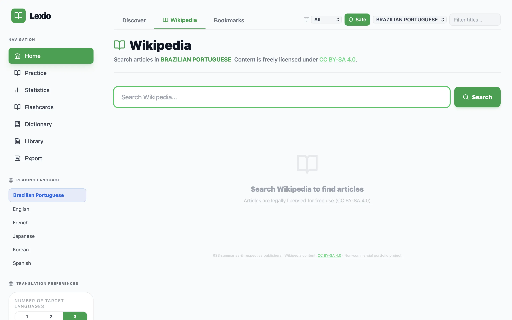
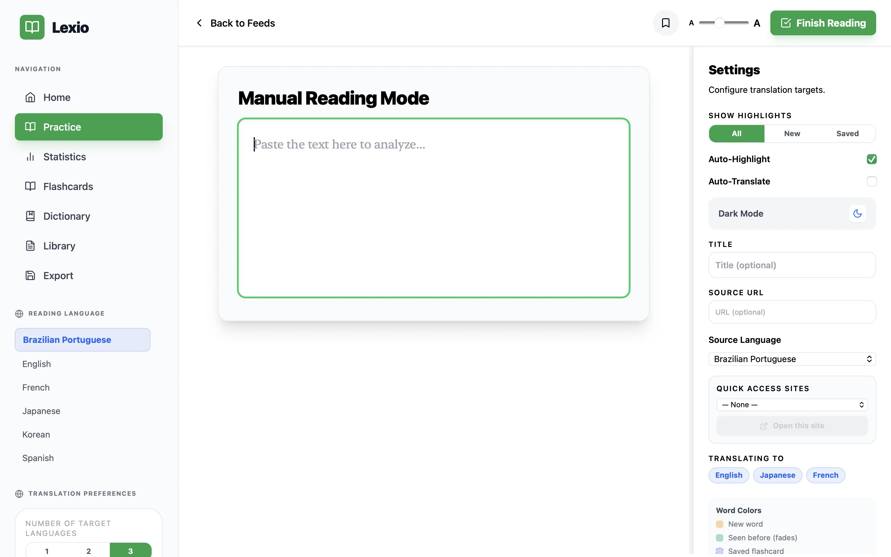
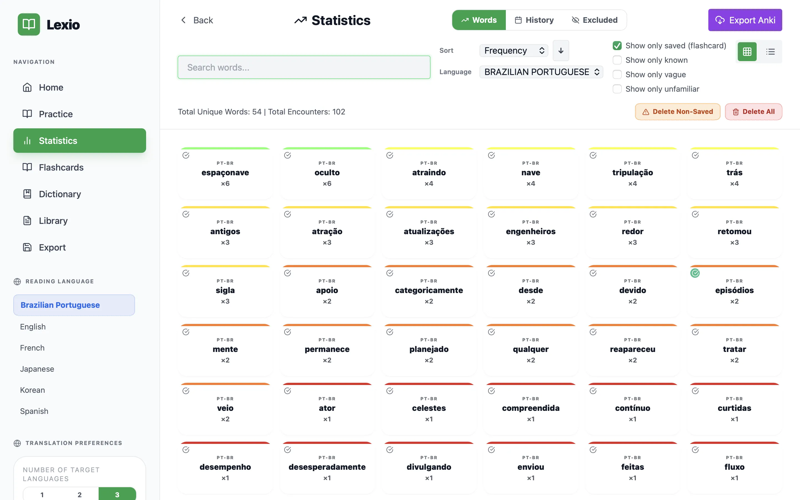

# Lexio

A privacy-first language learning tool for reading real-world content, tracking vocabulary with spaced-repetition flashcards, and visualizing your word knowledge with an interactive frequency heatmap.





## Features

- **RSS Feed Reader**: Curated RSS feeds in 6 languages — article text comes from RSS-provided content (legally provided by publishers for syndication)
- **Wikipedia Reader**: Search and read Wikipedia articles in any supported language (CC BY-SA 4.0) — provides reliable full-text content across all languages
- **Manual Text Mode**: Paste any text (news, books, lyrics) and read it with full word-tracking
- **Word Highlighting**: Words are color-coded by familiarity:
  - Yellow — new (never seen before)
  - Green (fading) — seen before, fewer encounters = brighter
  - Purple (dashed outline) — saved to flashcards
  - Orange (dashed outline) — marked as "vague" (passive knowledge)
  - No highlight — marked as known / excluded
- **Click Shortcuts**:
  - Click → View translation & definition
  - Alt+click → Toggle known
  - Shift+click → Toggle vague
  - Ctrl+click → Toggle flashcard (add/remove)
  - Shift+Alt+click → Exclude word (add to stopwords)
  - Arrow keys → Step through highlighted words
- **Flashcard Auto-Cleanup**: Marking a word as known, vague, or excluded automatically removes its flashcard
- **Spaced Repetition (SRS)**: SM-2 algorithm flashcard quiz with Again/Hard/Good/Easy ratings; resumes from where you left off
- **Dictionary Page**: Compact grid of all saved flashcards with search, language filter, sort, and lemma grouping; click to expand context sentences
- **Lemmatization**: Flashcards store the base/dictionary form of the saved word — Japanese via kuromoji (exact dictionary forms), European languages via Porter stemmer roots — enabling grouping of inflected forms in the Dictionary
- **WPM Tracker**: Live elapsed timer (⏱ mm:ss) in the Reader header; words-per-minute computed on "Finish Reading" and stored in reading history
- **Statistics / Frequency Heatmap**: Grid and list views of your word frequency, with sort, filter, search, and export
- **Pomodoro Timer**: Built-in focus timer with configurable work and break durations
- **Export**: TSV export compatible with Anki and other SRS apps
- **Offline Cache**: Articles and feeds cached via Service Worker (PWA) — continues to work without network
- **Dark Mode**: Full dark theme with a single toggle
- **PWA**: Installable as a standalone app on desktop and mobile (Add to Home Screen)
- **No API Keys Required**: All translation is client-side via the keyless Google Translate API

## Supported Languages

| Code    | Language             |
| ------- | -------------------- |
| `en`    | English              |
| `ja`    | Japanese             |
| `fr`    | French               |
| `es`    | Spanish              |
| `pt-BR` | Brazilian Portuguese |
| `ko`    | Korean               |

## Tech Stack

**Frontend** (`web/`)

- React 18 + TypeScript + Vite 7
- Tailwind CSS (dark mode via `class` strategy; custom colors: `dark-bg #1a1a1a`, `dark-surface #2a2a2a`, `dark-hover #3a3a3a`)
- Dexie.js — IndexedDB wrapper (all data stored locally, schema version 15)
- `dexie-react-hooks` (`useLiveQuery`) — reactive IndexedDB queries that update components automatically
- `Intl.Segmenter` — language-aware word/sentence tokenization
- `vite-plugin-pwa` — Service Worker + Web App Manifest for PWA/offline support
- Lucide React — icons

**Backend** (`server/`)

- Express.js — three endpoints:
  - `GET /api/rss-feed?url=...` — CORS proxy for RSS feeds; returns RSS-provided content (title, link, content, excerpt)
  - `GET /api/wikipedia?lang=...&search=...` or `?title=...` — Wikipedia article fetch and search (CC BY-SA)
  - `GET /api/tokenize?text=...&lang=...` — morphological analysis / lemmatization (kuromoji for `ja`, Porter stemmers for `en`/`fr`/`es`/`pt-BR`)
- `kuromoji` — Japanese morphological analyzer (dictionary loaded once on server start)
- `natural` — NLP toolkit providing Porter stemmers for European languages

**Testing**

- Vitest + jsdom for unit tests (`web/src/__tests__/`)
- `@testing-library/react` available for component tests

## Quick Start

```bash
# Install all dependencies (root + web + server)
npm run install-all

# Start both server (port 3001) and web (port 5173)
npm run dev
```

No `.env` file or API keys needed. Open http://localhost:5173.

## Development Commands

From the repo root:

```bash
npm run install-all   # install root + web + server dependencies
npm run dev           # run server + web concurrently
npm run dev:server    # server only (port 3001)
npm run dev:web       # web only (port 5173)
npm run build         # build both
```

From `web/`:

```bash
npm run lint          # ESLint (zero warnings enforced)
npm run test          # run unit tests (Vitest)
npm run test:watch    # watch mode
npx tsc --noEmit      # TypeScript type check
```

## Project Structure

```
lexio/
├── server/
│   ├── server.ts              # Express server (RSS proxy, Wikipedia, tokenizer)
│   ├── package.json
│   ├── tsconfig.json
│   └── .env.example
├── web/
│   ├── public/
│   │   └── icon.svg           # PWA app icon
│   ├── src/
│   │   ├── components/
│   │   │   ├── App.tsx        # Root — routing, session, theme
│   │   │   ├── AuthScreen.tsx # Local login / register
│   │   │   ├── Reader.tsx     # Article reader + word tracking + WPM timer
│   │   │   ├── HomePage.tsx   # RSS feed browser + Wikipedia search
│   │   │   ├── Dictionary.tsx # Flashcard dictionary with lemma grouping
│   │   │   ├── Flashcards.tsx # SRS flashcard grid + quiz
│   │   │   ├── FrequencyMap.tsx # Statistics / heatmap + Anki export
│   │   │   ├── Library.tsx    # Saved texts + bookmarks
│   │   │   ├── Sidebar.tsx    # Navigation + settings
│   │   │   ├── PomodoroTimer.tsx
│   │   │   └── QuickTooltip.tsx
│   │   ├── hooks/
│   │   │   ├── useArticleLoader.ts  # RSS content, Wikipedia fetch, offline cache
│   │   │   ├── useWordStatus.ts     # Known/vague/excluded word state
│   │   │   └── useWordTranslation.ts # Translation, flashcard save, lemma fetch
│   │   ├── lib/
│   │   │   ├── api.ts         # API_BASE constant
│   │   │   ├── constants.ts   # RSS feeds, language names
│   │   │   ├── nlp.ts         # Tokenization, stopwords, TTS, heatmap colors
│   │   │   ├── translate.ts   # Keyless Google Translate API
│   │   │   ├── types.ts       # Shared TypeScript interfaces
│   │   │   └── utils.ts
│   │   ├── db.ts              # Dexie schema (version 15)
│   │   ├── main.tsx
│   │   └── __tests__/         # Vitest unit tests
│   ├── index.html
│   ├── vite.config.ts         # Vite + vite-plugin-pwa config
│   ├── package.json
│   └── tailwind.config.js
├── package.json               # Root scripts (install-all, dev, build)
├── to-do.md                   # Roadmap (main / hosted / pro branches)
└── LICENSE                    # MIT
```

## Implementation Details

### Content Sources

The app uses two legal content sources:

1. **RSS feeds** — publishers explicitly provide content in their feed items for syndication. The server returns the RSS-provided `content` and `excerpt` fields directly; no scraping or full-page extraction is performed.
2. **Wikipedia** — CC BY-SA 4.0 licensed. The server calls the Wikimedia API with `explaintext=true` to get plaintext article content. Attribution is shown in the Reader when displaying Wikipedia content.

### Routing

Page routing is handled in `App.tsx` via a `currentPage` state typed as `Page` (`"home" | "reader" | "stats" | "export" | "flashcards" | "library" | "dictionary"`). There is no React Router — navigation is a state setter passed as props.

### Word Tokenization

`web/src/lib/nlp.ts` uses `Intl.Segmenter` with `granularity: "word"` for all languages. Japanese and Korean do not use space boundaries; `Intl.Segmenter` handles them natively.

French elisions (`d'abord`, `l'éco`) are split on `/['’]/` — the clitic prefix is preserved as a non-tracked span and the root (`abord`, `éco`) is tracked. `renderHighlighted` in `Reader.tsx` applies the same split at display time.

### Lemmatization

When a flashcard is saved, `fetchLemma` calls `GET /api/tokenize?text=<word>&lang=<lang>`:

- **Japanese** (`ja`): kuromoji returns `basic_form` — the exact dictionary form (e.g. `食べた` → `食べる`)
- **English** (`en`): Porter stemmer (e.g. `running` → `run`)
- **French** (`fr`), **Spanish** (`es`), **Portuguese** (`pt-BR`): language-specific Porter stemmers
- **Korean** (`ko`): returned as-is (no pure-JS Korean morphological analyzer available)

The `lemma` field on `Flashcard` enables the Dictionary page's "Group by lemma" toggle, which merges all inflected forms of the same word into one card.

### Stopwords

Per-language stopword sets live in `nlp.ts` (`STOPWORDS`). Users can opt individual stopwords back in (`AppSettings.stopwordExceptions`).

### Word Highlighting — No Layout Shift

Word spans use `box-shadow: inset 0 0 0 Npx <color>` for colored outlines. Inset box-shadows paint inside the existing box and don't affect layout, so adding/removing highlights never shifts surrounding text.

### Translation

`web/src/lib/translate.ts` calls the keyless Google Translate endpoint (`translate.googleapis.com/translate_a/single?client=gtx`). No API key is needed.

- `translateText(text, src, tgt)` — sentence/phrase translation (returns plain string)
- `fetchGoogleTranslate(word, src, tgt)` — dictionary lookup returning up to 3 POS groups with up to 2 translations each (`PosEntry[]`)

`toGoogleLang` converts `pt-BR → pt`; `fromGoogleLang` reverses it. Sentence translations are cached in IndexedDB (`translationCache` table).

### Flashcard SRS (SM-2)

`Flashcards.tsx` implements the SM-2 algorithm. Key fields on `Flashcard`:

| Field          | Type      | Description                                                    |
| -------------- | --------- | -------------------------------------------------------------- |
| `lemma`        | `string?` | Dictionary/base form (populated by `/api/tokenize`)            |
| `difficulty`   | `string?` | Last self-rating: `"again"`, `"hard"`, `"good"`, `"easy"`      |
| `easeFactor`   | `number`  | SM-2 ease factor, clamped to [1.3, 3.0], default 2.5           |
| `interval`     | `number`  | Current review interval in days                                |
| `nextReview`   | `number`  | Timestamp (ms) when card is next due                           |
| `lastReviewed` | `number`  | Timestamp (ms) of last review                                  |
| `contexts`     | `array`   | Sentence examples with translation, POS data, source title/URL |

### WPM Tracking

The Reader starts a timer when an article finishes loading. A `⏱ mm:ss` badge in the header shows elapsed time. On "Finish Reading", WPM is computed as `Math.round(totalWords / (elapsedSeconds / 60))` and stored in `ReadingHistory.wpm` and `ReadingHistory.readingDuration`.

### Offline / PWA

`vite-plugin-pwa` generates a Service Worker (Workbox) that precaches the app shell and applies runtime caching:

- Wikipedia responses: NetworkFirst, 24h TTL, max 50 entries
- RSS feed responses: NetworkFirst, 30m TTL, max 30 entries

The app is installable via "Add to Home Screen" on iOS/Android and "Install" in Chrome/Edge.

### Text-to-Speech

`speakText` in `nlp.ts` uses the Web Speech API. Voice selection is explicit by locale (stored in `AppSettings.ttsVoices`). In Chrome, voices load asynchronously — the function waits for `voiceschanged` before dispatching speech.

## Database Schema

All data lives in the browser's IndexedDB via Dexie (current version: **15**).

| Table              | Primary Key               | Indexed Fields                        | Purpose                                                       |
| ------------------ | ------------------------- | ------------------------------------- | ------------------------------------------------------------- |
| `appSettings`      | `id`                      | —                                     | Language order, translation targets, excluded words, Pomodoro |
| `flashcards`       | `++id`                    | `lang`, `word`, `nextReview`, `lemma` | Word cards with contexts, SM-2 metadata, and lemma            |
| `wordCounts`       | `langWord` (`lang\|word`) | `lang`, `count`                       | Per-language word frequency                                   |
| `knownWords`       | `++id`                    | `lang`, `word`, `confidence`          | Known and vague words                                         |
| `manualTexts`      | `++id`                    | `lang`, `addedAt`                     | User-saved manual texts                                       |
| `bookmarks`        | `++id`                    | `url`, `lang`                         | Bookmarked article URLs                                       |
| `readingHistory`   | `++id`                    | `lang`, `readAt`                      | Recently read articles (includes `wpm` and `readingDuration`) |
| `cachedArticles`   | `++id`                    | `url`                                 | Offline article cache (max 30, auto-evicts oldest)            |
| `translationCache` | `++id`                    | `cacheKey`                            | Client-side translation cache                                 |
| `customFeeds`      | `++id`                    | `lang`                                | User-added custom RSS feeds                                   |
| `favoriteSites`    | `++id`                    | `lang`                                | Favorited sites                                               |
| `users`            | `++id`                    | `&email` (unique)                     | Local user accounts                                           |
| `studySessions`    | `++id`                    | `lang`, `start`                       | Pomodoro / study session records                              |

When adding new fields, bump the version constant and add a `.upgrade()` migration.

## Privacy

- All user data is stored locally in your browser — no cloud, no accounts required
- Translation uses the Google Translate keyless endpoint (no API key sent from your browser)
- RSS feeds are proxied through the backend only to bypass CORS; no data is logged
- Wikipedia content is fetched server-side via the public Wikimedia API

## Legal

- RSS feed content: summaries and excerpts provided by publishers for syndication
- Wikipedia content: CC BY-SA 4.0 — attribution shown in the Reader
- This is a non-commercial portfolio project

## Testing

```bash
cd web && npm test            # run all tests once
cd web && npm run test:watch  # watch mode
```

Current coverage: `nlp.test.ts` (tokenization, stopwords), `translate.test.ts` (`toGoogleLang` / `fromGoogleLang`)
